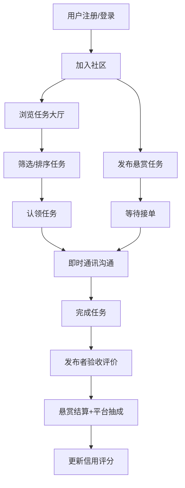

## 1. 产品概述

NeighborTask 是一个社区邻里互助悬赏平台，旨在连接同一小区或社区的居民，通过悬赏机制促进邻里间的互助行为。平台覆盖代取快递、遛宠物、家电维修、陪伴就医、辅导作业等多种生活场景，让邻里互助变得简单、可信、有回报。

- 解决社区邻里间互助需求与供给的信息不对称问题，降低互助门槛
- 面向城市社区居民，打造"远亲不如近邻"的数字化互助生态

## 2. 核心功能

### 2.1 用户角色

| 角色 | 注册方式 | 核心权限 |
|------|----------|----------|
| 普通用户 | 手机号/邮箱注册 | 发布任务、接单、即时通讯、个人中心 |
| 社区管理员 | 由平台管理员指定 | 审核本社区任务、管理社区成员、处理社区投诉 |
| 平台管理员 | 系统预设 | 全局管理、费率配置、仲裁处理、数据统计 |

### 2.2 功能模块

1. **登录注册页**: 手机号/邮箱注册、登录、JWT认证
2. **社区加入页**: 通过邀请码或地理位置匹配加入小区社区
3. **任务大厅页**: 卡片列表展示待接任务，支持类别筛选、距离/赏金排序、地图视图
4. **任务发布页**: 填写任务描述、悬赏金额、紧急程度、截止时间、类别、位置
5. **任务详情页**: 任务信息、接单操作、即时通讯、验收评价
6. **即时通讯页**: WebSocket实时消息，任务相关沟通
7. **个人中心页**: 信用评分、接发单统计、收支明细、提现申请
8. **社区排行榜页**: 月度接单数排行、好评率排行
9. **管理后台页**: 任务审核、投诉仲裁、费率配置、积分规则

### 2.3 页面详情

| 页面名称 | 模块名称 | 功能描述 |
|----------|----------|----------|
| 登录注册页 | 注册表单 | 手机号/邮箱+密码注册，表单校验 |
| 登录注册页 | 登录表单 | 手机号/邮箱+密码登录，JWT令牌返回 |
| 社区加入页 | 邀请码加入 | 输入社区邀请码匹配并加入社区 |
| 社区加入页 | 地理位置匹配 | 基于GPS定位推荐附近社区 |
| 任务大厅页 | 任务卡片列表 | 卡片式展示任务标题、赏金、类别、距离、紧急度 |
| 任务大厅页 | 筛选排序栏 | 按类别筛选、距离排序、赏金排序 |
| 任务大厅页 | 地图视图 | Leaflet地图展示任务地理分布标记 |
| 任务发布页 | 任务表单 | 填写描述、赏金、紧急程度、截止时间、类别、位置 |
| 任务详情页 | 任务信息展示 | 展示任务完整信息、发布者信息 |
| 任务详情页 | 接单操作 | 一键认领任务，状态变更为进行中 |
| 任务详情页 | 即时通讯面板 | WebSocket实时聊天，沟通任务细节 |
| 任务详情页 | 验收评价 | 发布者确认完成、五星评分+文字评价 |
| 个人中心页 | 信用评分 | 基于完成率与评价的信用分展示 |
| 个人中心页 | 接发单统计 | 发单数、接单数、完成率统计 |
| 个人中心页 | 收支明细 | 赏金收入/支出流水明细 |
| 个人中心页 | 提现申请 | 提现至绑定账户 |
| 社区排行榜页 | 接单排行 | 月度接单数量排行 |
| 社区排行榜页 | 好评排行 | 月度好评率排行 |
| 管理后台页 | 任务审核 | 审核任务发布内容 |
| 管理后台页 | 投诉仲裁 | 处理用户投诉与争议仲裁 |
| 管理后台页 | 费率配置 | 配置平台服务费比例 |
| 管理后台页 | 积分规则 | 配置虚拟积分兑换规则 |

## 3. 核心流程

用户注册登录后，通过邀请码或定位加入社区，在任务大厅浏览或发布悬赏任务。接单者认领任务后双方通过即时通讯沟通，完成后发布者验收评价，系统自动结算悬赏并收取平台服务费。

## 4. 用户界面设计

### 4.1 设计风格

- **主色调**: 暖橙色 (#F97316) 搭配米白色背景 (#FFFBF0)，营造温暖邻家氛围
- **辅助色**: 柔和绿色 (#22C55E) 表示完成/成功，淡蓝色 (#3B82F6) 表示信息提示，暖红色 (#EF4444) 表示紧急/警告
- **按钮风格**: 圆角大按钮，略带阴影的3D质感，悬停时有轻微上浮动画
- **字体**: 标题使用 "Noto Sans SC" 粗体，正文使用 "Noto Sans SC" 常规，营造亲切感
- **布局风格**: 卡片式布局，圆角卡片配柔和阴影，顶部导航栏，侧边社区信息
- **图标风格**: 线条圆润的 Lucide 图标，搭配温暖的色调

### 4.2 页面设计概览

| 页面名称 | 模块名称 | UI元素 |
|----------|----------|--------|
| 登录注册页 | 表单区域 | 居中卡片，暖色渐变背景，圆角输入框，大号橙色按钮 |
| 社区加入页 | 加入方式选择 | 双栏卡片选择（邀请码/定位），地图组件嵌入定位选择 |
| 任务大厅页 | 任务卡片列表 | 网格卡片，左上类别标签（彩色），右上赏金金额，底部紧急度标签 |
| 任务大厅页 | 筛选排序栏 | 顶部粘性栏，类别标签组，排序下拉框 |
| 任务大厅页 | 地图视图 | Leaflet全幅地图，自定义暖色标记点，点击弹出任务摘要 |
| 任务发布页 | 任务表单 | 分步表单，步骤指示器，大输入区域，紧急程度滑块 |
| 任务详情页 | 信息区域 | 顶部任务状态横幅，信息卡片，底部操作按钮 |
| 任务详情页 | 聊天面板 | 右侧抽屉式聊天窗口，气泡消息，快捷回复 |
| 任务详情页 | 评价组件 | 五星评分交互，文字输入框，评价标签快捷选择 |
| 个人中心页 | 信用评分 | 圆形进度环展示信用分，渐变色环 |
| 个人中心页 | 统计面板 | 三列数字统计卡片，收支明细时间线 |
| 排行榜页 | 排行列表 | 前三名特殊样式（金银铜），列表项带头像与数据 |
| 管理后台页 | 审核列表 | 表格式列表，状态标签，操作按钮组 |

### 4.3 响应式设计

- 桌面优先设计，1200px以上完整展示
- 平板端（768-1200px）隐藏地图侧栏，聊天面板改为全屏弹窗
- 移动端（<768px）底部导航替代侧边栏，卡片单列展示，筛选改为下拉抽屉

### 4.4 3D场景指引

不适用
