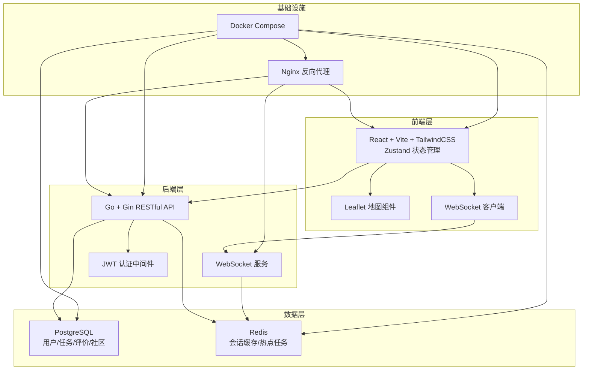
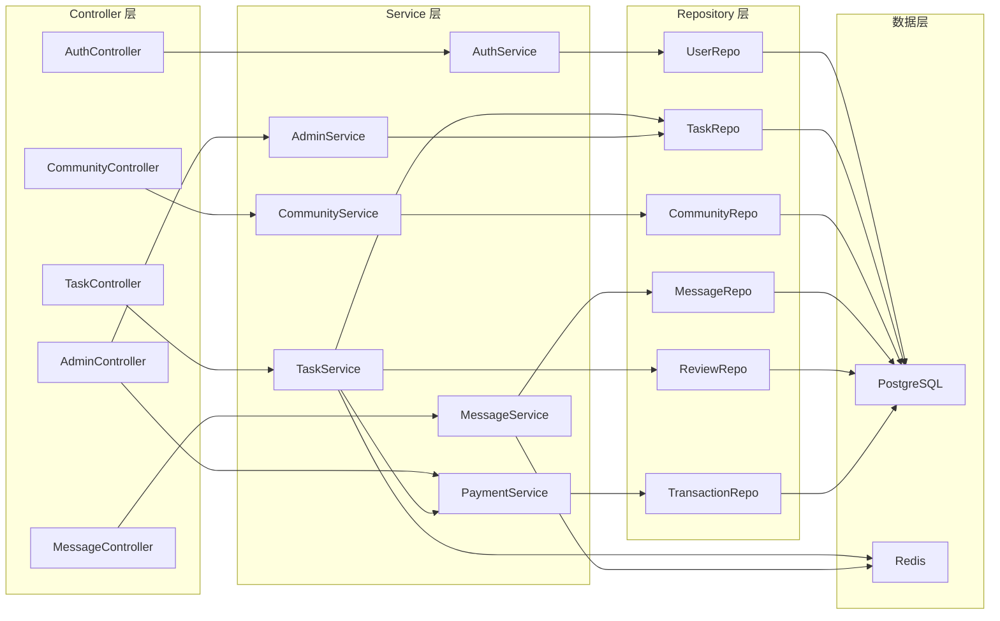
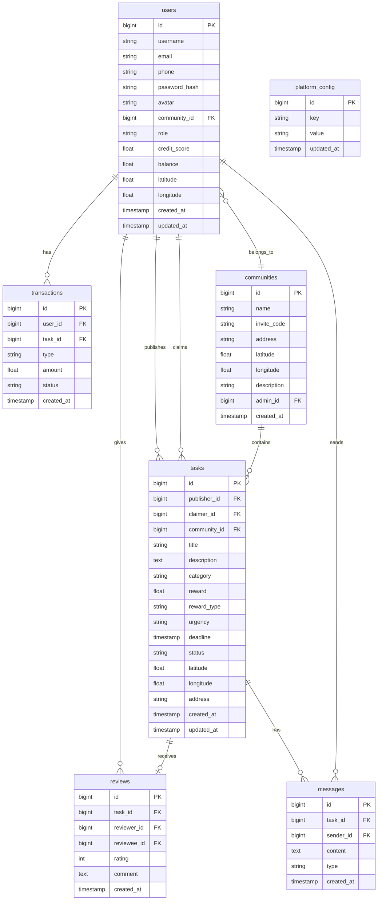

## 1. 架构设计



## 2. 技术说明

- **前端**: React@18 + TypeScript + Vite + TailwindCSS@3 + Zustand + Leaflet
- **后端**: Go@1.21 + Gin + GORM + gorilla/websocket
- **数据库**: PostgreSQL@15（主数据存储）+ Redis@7（缓存与会话）
- **认证**: JWT（访问令牌 + 刷新令牌）
- **实时通讯**: WebSocket（gorilla/websocket）
- **容器化**: Docker + docker-compose，Nginx 反向代理
- **地图**: Leaflet + OpenStreetMap 瓦片

## 3. 路由定义

| 路由 | 用途 |
|------|------|
| / | 首页/任务大厅 |
| /login | 登录页 |
| /register | 注册页 |
| /community/join | 加入社区 |
| /tasks | 任务大厅列表 |
| /tasks/map | 任务地图视图 |
| /tasks/new | 发布新任务 |
| /tasks/:id | 任务详情页 |
| /profile | 个人中心 |
| /profile/transactions | 收支明细 |
| /profile/withdraw | 提现申请 |
| /leaderboard | 社区排行榜 |
| /messages | 消息列表 |
| /admin | 管理后台首页 |
| /admin/tasks | 任务审核 |
| /admin/complaints | 投诉仲裁 |
| /admin/config | 费率与积分配置 |

## 4. API 定义

### 4.1 认证相关

```
POST   /api/v1/auth/register     注册
POST   /api/v1/auth/login        登录
POST   /api/v1/auth/refresh      刷新令牌
GET    /api/v1/auth/me           当前用户信息
```

### 4.2 社区相关

```
GET    /api/v1/communities           社区列表（附近搜索）
GET    /api/v1/communities/:id       社区详情
POST   /api/v1/communities/join      加入社区（邀请码）
POST   /api/v1/communities/join-by-location  基于定位加入
GET    /api/v1/communities/:id/members 社区成员列表
```

### 4.3 任务相关

```
GET    /api/v1/tasks                 任务列表（支持筛选排序）
GET    /api/v1/tasks/:id             任务详情
POST   /api/v1/tasks                 创建任务
PUT    /api/v1/tasks/:id             更新任务
POST   /api/v1/tasks/:id/claim       认领任务
POST   /api/v1/tasks/:id/complete    标记完成
POST   /api/v1/tasks/:id/confirm     确认验收
POST   /api/v1/tasks/:id/cancel      取消任务
```

### 4.4 评价相关

```
POST   /api/v1/tasks/:id/review      提交评价
GET    /api/v1/users/:id/reviews      用户评价列表
```

### 4.5 即时通讯

```
GET    /api/v1/conversations          会话列表
GET    /api/v1/conversations/:id/messages 消息历史
WS     /api/v1/ws                     WebSocket连接
```

### 4.6 用户相关

```
GET    /api/v1/users/:id              用户公开信息
GET    /api/v1/users/me/stats         我的统计数据
GET    /api/v1/users/me/transactions  收支明细
POST   /api/v1/users/me/withdraw      提现申请
GET    /api/v1/users/me/credit        信用评分
```

### 4.7 排行榜

```
GET    /api/v1/leaderboard/tasks      接单数排行
GET    /api/v1/leaderboard/rating     好评率排行
```

### 4.8 管理后台

```
GET    /api/v1/admin/tasks/pending    待审核任务
PUT    /api/v1/admin/tasks/:id/review 审核任务
GET    /api/v1/admin/complaints       投诉列表
PUT    /api/v1/admin/complaints/:id   处理投诉
GET    /api/v1/admin/config           获取平台配置
PUT    /api/v1/admin/config           更新平台配置
```

## 5. 服务端架构图



## 6. 数据模型

### 6.1 数据模型定义



### 6.2 数据定义语言

```sql
CREATE TABLE users (
    id BIGSERIAL PRIMARY KEY,
    username VARCHAR(50) NOT NULL UNIQUE,
    email VARCHAR(100) UNIQUE,
    phone VARCHAR(20) UNIQUE,
    password_hash VARCHAR(255) NOT NULL,
    avatar VARCHAR(500),
    community_id BIGINT REFERENCES communities(id),
    role VARCHAR(20) NOT NULL DEFAULT 'user',
    credit_score DECIMAL(5,2) NOT NULL DEFAULT 100.00,
    balance DECIMAL(12,2) NOT NULL DEFAULT 0.00,
    latitude DECIMAL(10,7),
    longitude DECIMAL(10,7),
    created_at TIMESTAMP NOT NULL DEFAULT NOW(),
    updated_at TIMESTAMP NOT NULL DEFAULT NOW()
);

CREATE TABLE communities (
    id BIGSERIAL PRIMARY KEY,
    name VARCHAR(100) NOT NULL,
    invite_code VARCHAR(20) NOT NULL UNIQUE,
    address VARCHAR(255),
    latitude DECIMAL(10,7),
    longitude DECIMAL(10,7),
    description TEXT,
    admin_id BIGINT REFERENCES users(id),
    created_at TIMESTAMP NOT NULL DEFAULT NOW()
);

CREATE TABLE tasks (
    id BIGSERIAL PRIMARY KEY,
    publisher_id BIGINT NOT NULL REFERENCES users(id),
    claimer_id BIGINT REFERENCES users(id),
    community_id BIGINT NOT NULL REFERENCES communities(id),
    title VARCHAR(200) NOT NULL,
    description TEXT NOT NULL,
    category VARCHAR(50) NOT NULL,
    reward DECIMAL(12,2) NOT NULL,
    reward_type VARCHAR(20) NOT NULL DEFAULT 'credit',
    urgency VARCHAR(20) NOT NULL DEFAULT 'normal',
    deadline TIMESTAMP,
    status VARCHAR(20) NOT NULL DEFAULT 'pending',
    latitude DECIMAL(10,7),
    longitude DECIMAL(10,7),
    address VARCHAR(255),
    created_at TIMESTAMP NOT NULL DEFAULT NOW(),
    updated_at TIMESTAMP NOT NULL DEFAULT NOW()
);

CREATE TABLE reviews (
    id BIGSERIAL PRIMARY KEY,
    task_id BIGINT NOT NULL UNIQUE REFERENCES tasks(id),
    reviewer_id BIGINT NOT NULL REFERENCES users(id),
    reviewee_id BIGINT NOT NULL REFERENCES users(id),
    rating SMALLINT NOT NULL CHECK (rating >= 1 AND rating <= 5),
    comment TEXT,
    created_at TIMESTAMP NOT NULL DEFAULT NOW()
);

CREATE TABLE messages (
    id BIGSERIAL PRIMARY KEY,
    task_id BIGINT NOT NULL REFERENCES tasks(id),
    sender_id BIGINT NOT NULL REFERENCES users(id),
    content TEXT NOT NULL,
    type VARCHAR(20) NOT NULL DEFAULT 'text',
    created_at TIMESTAMP NOT NULL DEFAULT NOW()
);

CREATE TABLE transactions (
    id BIGSERIAL PRIMARY KEY,
    user_id BIGINT NOT NULL REFERENCES users(id),
    task_id BIGINT REFERENCES tasks(id),
    type VARCHAR(30) NOT NULL,
    amount DECIMAL(12,2) NOT NULL,
    status VARCHAR(20) NOT NULL DEFAULT 'completed',
    created_at TIMESTAMP NOT NULL DEFAULT NOW()
);

CREATE TABLE platform_config (
    id BIGSERIAL PRIMARY KEY,
    key VARCHAR(100) NOT NULL UNIQUE,
    value VARCHAR(500) NOT NULL,
    updated_at TIMESTAMP NOT NULL DEFAULT NOW()
);

CREATE INDEX idx_tasks_community_status ON tasks(community_id, status);
CREATE INDEX idx_tasks_category ON tasks(category);
CREATE INDEX idx_tasks_reward ON tasks(reward DESC);
CREATE INDEX idx_tasks_deadline ON tasks(deadline);
CREATE INDEX idx_messages_task ON messages(task_id, created_at);
CREATE INDEX idx_transactions_user ON transactions(user_id, created_at DESC);
CREATE INDEX idx_reviews_reviewee ON reviews(reviewee_id);
CREATE INDEX idx_users_community ON users(community_id);

INSERT INTO platform_config (key, value) VALUES
    ('service_fee_rate', '0.05'),
    ('min_withdraw_amount', '10.00'),
    ('credit_score_base', '100.00'),
    ('credit_score_task_complete_bonus', '2.00'),
    ('credit_score_task_fail_penalty', '5.00'),
    ('credit_score_five_star_bonus', '1.00');
```
